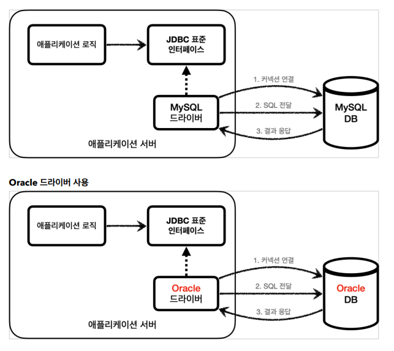
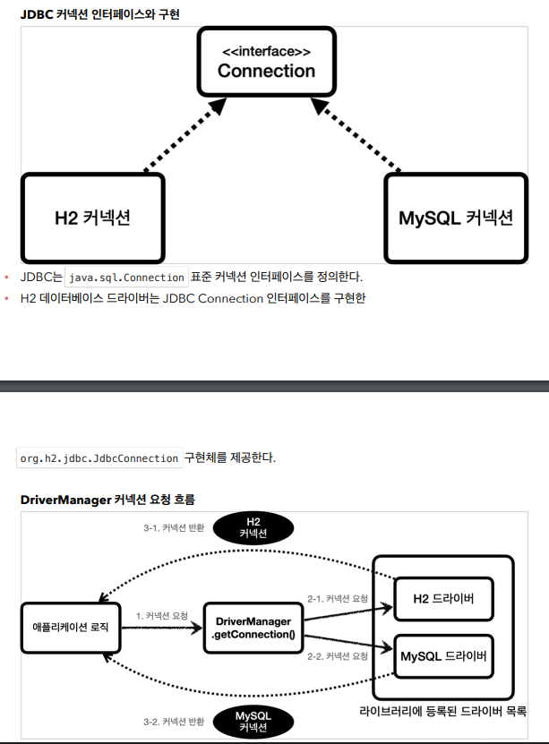

# 정리

## jdbc 표준 인터페이스

- 예전 연결방법
1. was -> db ( 커넥션 연결 ) sql.Connection
2. was -> db ( sql 전달 ) sql.Statement
3. was <- db ( 결과응답 ) sql.ResultSet

### db마다 1,2,3번 과정의 내용이 다 달라서 표준이 필요했다

### 해당 DB의 드라이버만 라이브러리로 받아오면 된다

### 커넥션 요청흐름

1. 애플리케이션 로직에서 커넥션이 필요하면 DriverManager.getConnection() 호출
2. **DriverManager**은 라이브러리에 등록된 드라이버 목록 자동 인식하고 정보를넘김 ( url , username , password)
3. 각각의 드라이버는 url정보를 확인해서 본이 처리 할 수 있는지 확인하고 처리함
4. 이렇게 찾은 커넥션 구현체가 클라이언트에게 반환

### 커넥션 풀 이해

