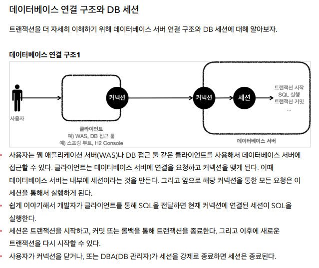
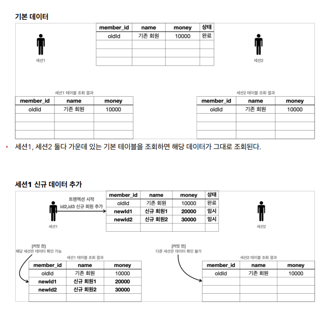

# 정리

## jdbc 표준 인터페이스

- 예전 연결방법
1. was -> db ( 커넥션 연결 ) sql.Connection
2. was -> db ( sql 전달 ) sql.Statement
3. was <- db ( 결과응답 ) sql.ResultSet

### db마다 1,2,3번 과정의 내용이 다 달라서 표준이 필요했다

### 해당 DB의 드라이버만 라이브러리로 받아오면 된다

### 커넥션 요청흐름

1. 애플리케이션 로직에서 커넥션이 필요하면 DriverManager.getConnection() 호출
2. **DriverManager**은 라이브러리에 등록된 드라이버 목록 자동 인식하고 정보를넘김 ( url , username , password)
3. 각각의 드라이버는 url정보를 확인해서 본이 처리 할 수 있는지 확인하고 처리함
4. 이렇게 찾은 커넥션 구현체가 클라이언트에게 반환

### 커넥션 풀 이해

### 데이터소스 이해

- 커넥션을 획득하는 방법은 여러가지다 ( driver Manger이용 or 커넥션풀 등)
- 이 방법을 추상화 한 인터페이스가 **DataSource**다

- 필요한 데이터를 DataSource가 만들어지는 시점에 미리 다 넣어두고 DataSource를 사용하는 곳 에서는 dataSource.getConnection()만 호출하면 된다 (URL,USERNAME,PASSWORD)등 속성에 의존 안해도 된다

- 설정과 사용하는곳을 분리하는 장점이 생긴다

### 트랜잭션 개념이해

- db에서 가장 강력한 기능 ( db를 쓰는 이유  )

- 커밋을 호출하기 전까지는 임시로 데이터를 저장한다

- 해당 트랜잭션을 시작한 세션(사용자)에게만 변경 데이터가 보이고 다른 세션(다른 사용자)는 변경 데이터가 보이지 않는다

### 자동커밋 & 수동커밋

- 수동커밋이 트랜잭션을 시작한다고 표현 할 수 있다

### DB 락 개념이해

- 세션1이 트랜잭션을 시작하고 데이터를 수정하는 동안 세션2에서 데이터를 수정 못하게 락을 건다 ( 해당 로우에 락을 검)

- 트랜잭션 시작 -> 락 획득 -> 데이터 변경 -> 커밋 -> 락 반환 

- 락을 획득해야 데이터를 수정 할 수 있다