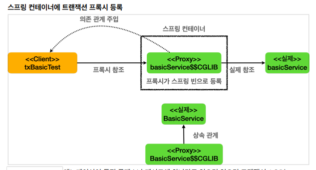

# 스프링 트랜잭션 이해

- @Transactional 애너테이션이 있으면 실제 baseService대신에  프록시인 $CGLIB을 스프링 빈에 등록한다  , 이 프록시는 내부에 실제 baseService를 참조함

## 트랜잭션 적용 위치

### @Transacional 의 우선순위

- 스프링에서 우선순위는 항상 **더 구체적이고 자세한 것이 높은 우선순위를 가진다** ( ex 클래스에 적용해도 메서드에 따로 적용하면 메서드가 우선)